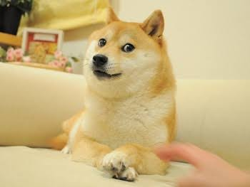
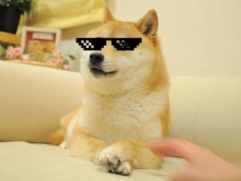

# WorkShop 1
# Sturdy-Octo-Disco-Adding-Sunglasses-for-a-Cool-New-Look

### Developed by: Deepak K R
### Reg No: 212225040057

Sturdy Octo Disco is a fun project that adds sunglasses to photos using image processing.

Welcome to Sturdy Octo Disco, a fun and creative project designed to overlay sunglasses on individual passport photos! This repository demonstrates how to use image processing techniques to create a playful transformation, making ordinary photos look extraordinary. Whether you're a beginner exploring computer vision or just looking for a quirky project to try, this is for you!

## Features:
- Detects the face in an image.
- Places a stylish sunglass overlay perfectly on the face.
- Works seamlessly with individual passport-size photos.
- Customizable for different sunglasses styles or photo types.

## Technologies Used:
- Python
- OpenCV for image processing
- Numpy for array manipulations

## How to Use:
1. Clone this repository.
2. Add your passport-sized photo to the `images` folder.
3. Run the script to see your "cool" transformation!

## Applications:
- Learning basic image processing techniques.
- Adding flair to your photos for fun.
- Practicing computer vision workflows.

## Program: 

```python

import cv2
import numpy as np
import matplotlib.pyplot as plt

image = cv2.imread("Dog.jpg")
glass = cv2.imread("1.png", cv2.IMREAD_UNCHANGED)

image = cv2.cvtColor(image, cv2.COLOR_BGR2RGB)

plt.imshow(image)

```

```python

x = 105
y = 30
width = 110
height = int(glass.shape[0] * width / glass.shape[1])

glass = cv2.resize(glass, (width, height), interpolation=cv2.INTER_AREA)

roi = image[y:y+height, x:x+width]

alpha = glass[:, :, 3].astype(float) / 255
alpha = np.repeat(alpha[:, :, np.newaxis], 3, axis=2)

glass_rgb = cv2.cvtColor(glass[:, :, :3], cv2.COLOR_BGR2RGB)

blended = glass_rgb * alpha + roi * (1 - alpha)

result = image.copy()
result[y:y+height, x:x+width] = np.clip(blended, 0, 255).astype(np.uint8)

cv2.imwrite("Dog_glass.jpg", cv2.cvtColor(result, cv2.COLOR_RGB2BGR))

plt.figure(figsize=(8, 8))
plt.imshow(result)
plt.show()

```

## Output:





## Result:
The sunglasses were successfully placed over the eye region of the given image using image masking and alpha blending. The final processed image was displayed successfully in the Jupyter Notebook.